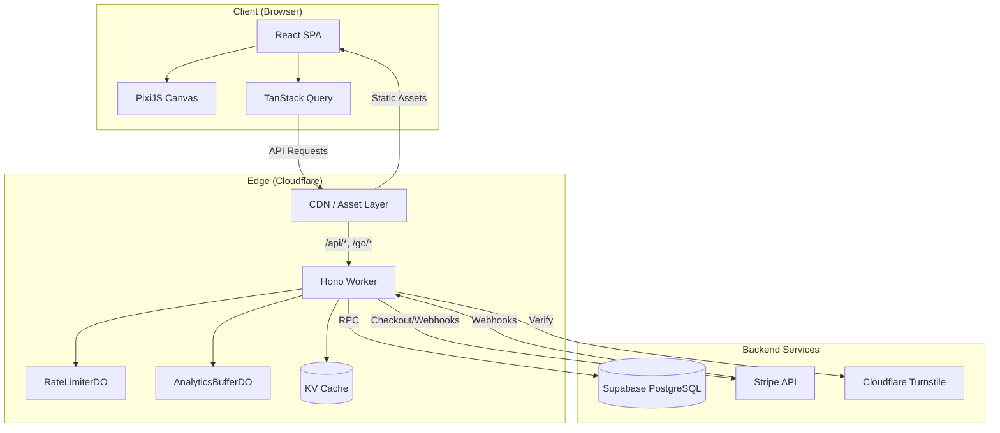
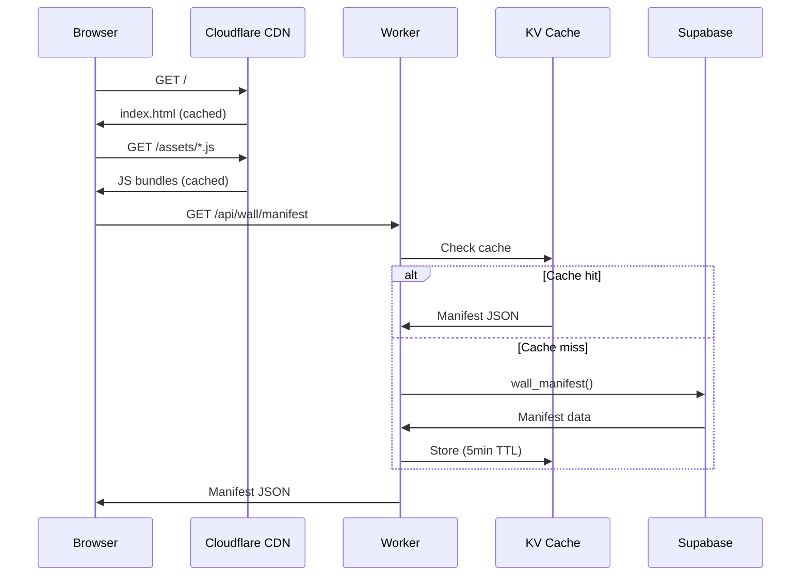
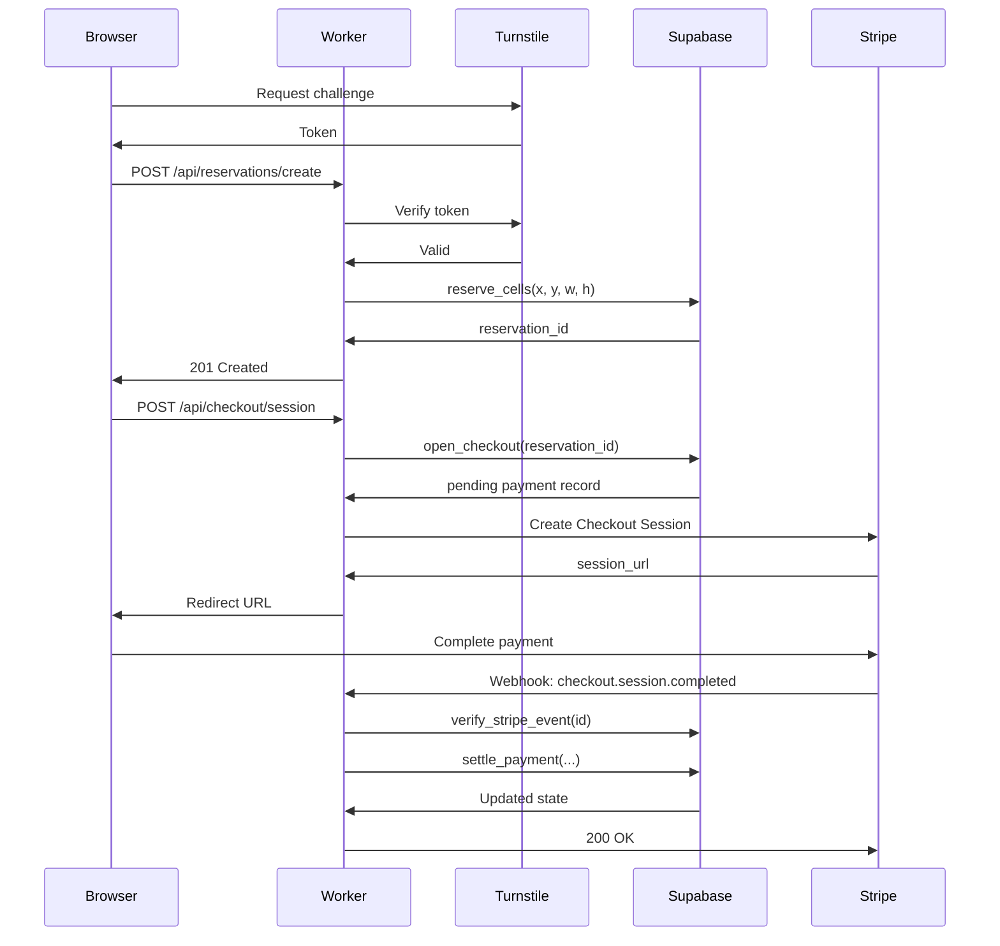
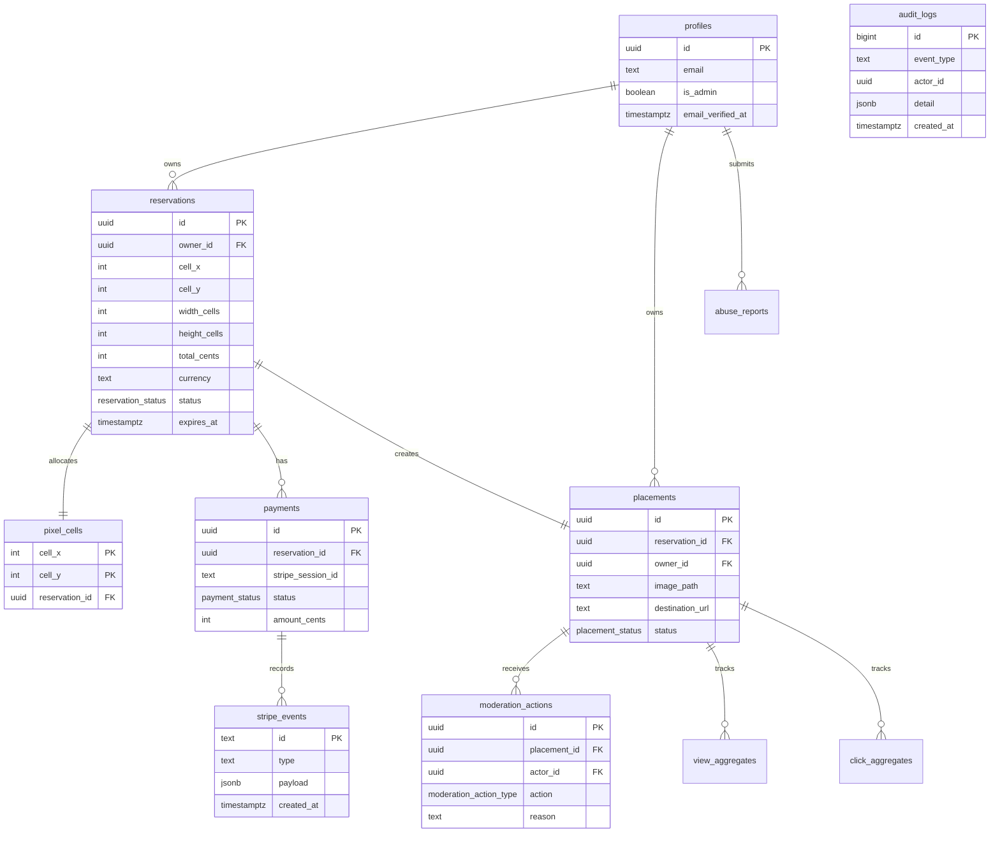
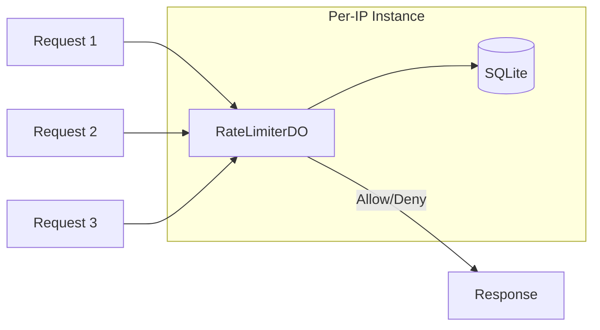
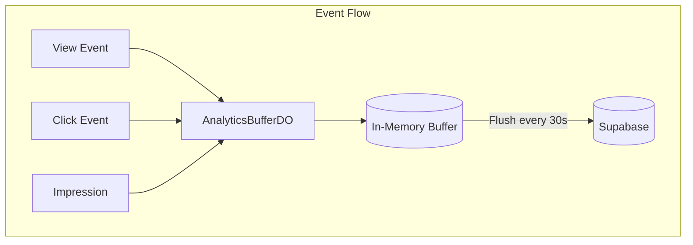
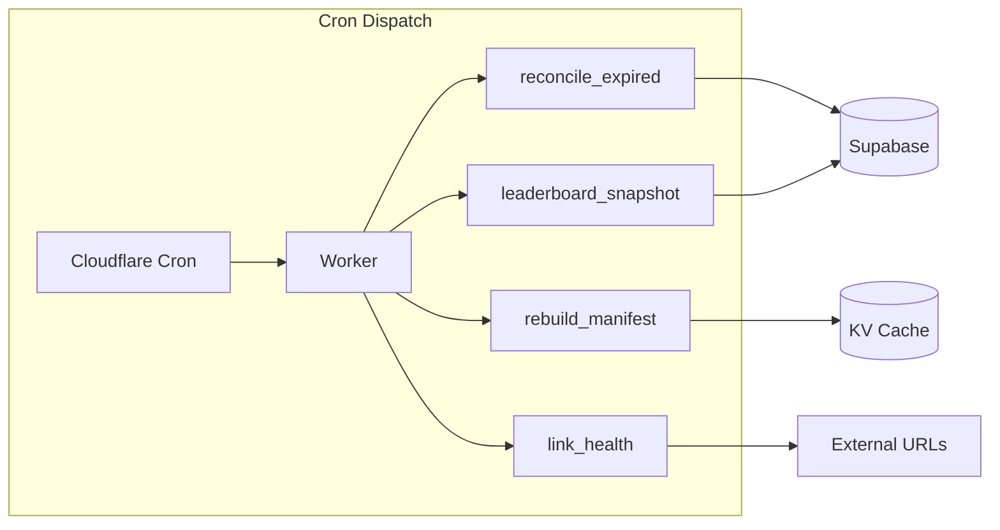
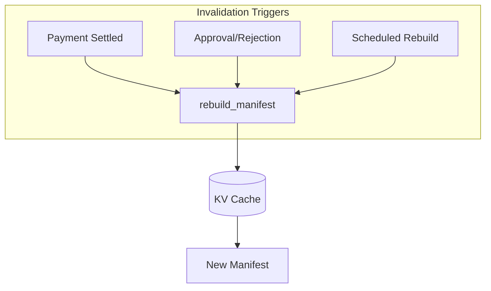
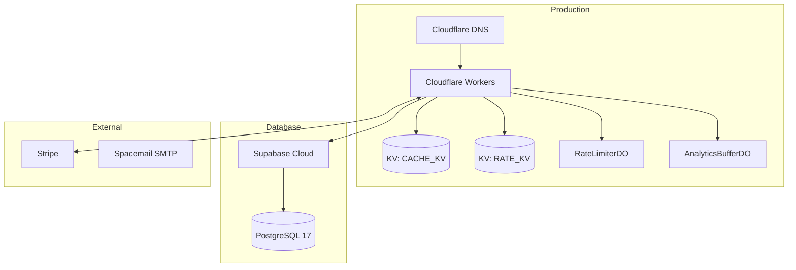

# HQPixels Architecture

This document describes the system architecture of HQPixels, an interactive pixel-ad marketplace.

## High-Level System Diagram



## Request Flow

### Public Page Load



### Claim Flow (Purchase)



## Database Schema



## Durable Objects

### RateLimiterDO

Sliding-window rate limiter using SQLite storage within Durable Objects.



**Configuration:**

- 60 requests per minute for anonymous users
- 120 requests per minute for authenticated users
- 10 requests per minute for mutations (POST/PUT/DELETE)

### AnalyticsBufferDO

Batches analytics events to reduce database writes.



**Events buffered:**

- Page views (per placement)
- Link clicks (per placement)
- Impressions (viewport visibility)

## Cron Jobs

| Job                    | Schedule    | Purpose                                         |
| ---------------------- | ----------- | ----------------------------------------------- |
| `reconcile_expired`    | Every 5 min | Expire unpaid reservations, release cells       |
| `rebuild_manifest`     | Every 5 min | Regenerate wall manifest from active placements |
| `link_health`          | Daily       | Check destination URLs, disable broken links    |
| `leaderboard_snapshot` | Hourly      | Capture top placements by views/clicks          |



## Cache Strategy

### Cache Layers

| Layer            | TTL    | Content                                |
| ---------------- | ------ | -------------------------------------- |
| CDN (Cloudflare) | 1 year | Static assets (immutable hashes)       |
| KV Cache         | 5 min  | Wall manifest, pricing, stats          |
| Browser          | 5 min  | API responses (stale-while-revalidate) |

### Cache Invalidation



**Invalidation events:**

- Payment settled → Placement becomes active
- Moderation action → Placement visibility changes
- Reservation expired → Cells released

## API Routes

| Route                      | Method  | Auth   | Purpose                   |
| -------------------------- | ------- | ------ | ------------------------- |
| `/api/auth/*`              | Various | Public | PKCE auth flow            |
| `/api/public/pricing`      | GET     | Public | Current pricing info      |
| `/api/public/stats`        | GET     | Public | Aggregate statistics      |
| `/api/wall/manifest`       | GET     | Public | Active placements         |
| `/api/reservations/create` | POST    | Auth   | Reserve cells             |
| `/api/uploads/request`     | POST    | Auth   | Get presigned upload URL  |
| `/api/checkout/session`    | POST    | Auth   | Create Stripe session     |
| `/api/stripe/webhook`      | POST    | Stripe | Payment events            |
| `/api/dashboard/*`         | Various | Auth   | User dashboard            |
| `/api/admin/*`             | Various | Admin  | Moderation queue          |
| `/go/:id`                  | GET     | Public | Redirect to placement URL |

## Security Architecture

See [SECURITY.md](SECURITY.md) for detailed security documentation.

**Key security layers:**

1. **Edge**: CSRF, origin validation, rate limiting, body limits
2. **Database**: RLS policies, state machine triggers, immutable audit
3. **Payments**: Webhook signature verification, price from DB only
4. **Content**: Magic-byte image validation, no user HTML/JS/CSS

## Deployment Architecture



## File Structure

```
worker/
├── index.ts          # Entry point (fetch + scheduled)
├── app.ts            # Hono app factory
├── context.ts        # Request context types
├── middleware.ts     # Global middleware
├── env.ts            # Environment validation
├── routes/           # API route handlers
│   ├── admin.ts      # Moderation endpoints
│   ├── auth.ts       # PKCE auth flow
│   ├── checkout.ts   # Stripe checkout
│   ├── dashboard.ts  # User dashboard
│   ├── go.ts         # Redirect handler
│   ├── public.ts     # Public data
│   ├── reservations.ts # Cell reservation
│   ├── seo.ts        # robots.txt, sitemap
│   ├── stripe-webhook.ts # Payment webhooks
│   └── uploads.ts    # Image upload
├── lib/              # Shared utilities
│   ├── audit.ts      # Audit logging
│   ├── auth.ts       # Session management
│   ├── cache.ts      # Cache helpers
│   ├── cookies.ts    # Cookie parsing
│   ├── crypto.ts     # HMAC, signatures
│   ├── csrf.ts       # CSRF protection
│   ├── errors.ts     # Error handling
│   ├── http-security.ts # CSP headers
│   ├── images.ts     # Magic-byte validation
│   ├── logger.ts     # Redacting logger
│   ├── rate-limit.ts # DO rate limiting
│   ├── stripe.ts     # Stripe client
│   ├── supabase.ts   # Typed RPC client
│   └── turnstile.ts  # CAPTCHA verification
├── do/               # Durable Objects
│   ├── RateLimiterDO.ts
│   └── AnalyticsBufferDO.ts
└── jobs/             # Scheduled jobs
    ├── cron-dispatch.ts
    ├── reconcile-expire.ts
    ├── rebuild-manifest.ts
    └── link-health.ts
```
