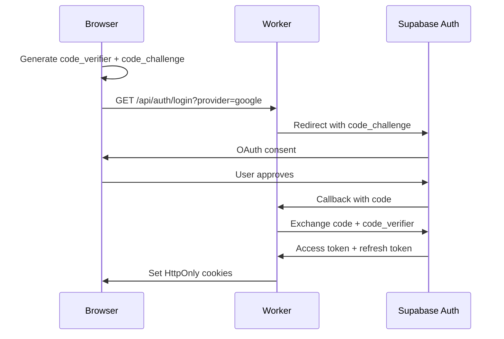
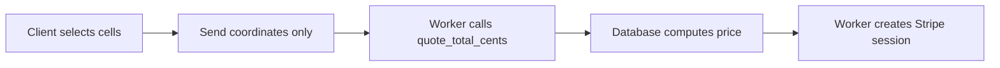

# HQPixels Security Documentation

This document describes the security architecture, controls, and residual risks of HQPixels.

## Table of Contents

1. [Authentication](#authentication)
2. [Authorization](#authorization)
3. [Payment Security](#payment-security)
4. [Input Validation](#input-validation)
5. [Content Security Policy](#content-security-policy)
6. [Security Headers](#security-headers)
7. [Image Upload Security](#image-upload-security)
8. [Rate Limiting](#rate-limiting)
9. [Audit Logging](#audit-logging)
10. [Residual Risk Register](#residual-risk-register)

---

## Authentication

### Supabase PKCE Flow

HQPixels uses Supabase Auth with the PKCE (Proof Key for Code Exchange) flow for secure authentication.



**Security features:**

- PKCE prevents authorization code interception
- Tokens stored in `HttpOnly`, `Secure`, `SameSite=Lax` cookies
- No tokens in localStorage or JavaScript-accessible storage
- Refresh tokens rotated on each use

### Session Management

| Cookie             | Flags                             | Purpose               |
| ------------------ | --------------------------------- | --------------------- |
| `sb-access-token`  | HttpOnly, Secure, SameSite=Lax    | JWT access token      |
| `sb-refresh-token` | HttpOnly, Secure, SameSite=Lax    | Refresh token         |
| `csrf-token`       | HttpOnly, Secure, SameSite=Strict | CSRF protection       |
| `visitor`          | Secure, SameSite=Lax              | Analytics correlation |

---

## Authorization

### Row-Level Security (RLS)

All database tables have RLS enabled with explicit policies:

```sql
-- Example: Users can only see their own reservations
CREATE POLICY "reservations_owner_select" ON reservations
  FOR SELECT TO authenticated
  USING (owner_id = auth.uid());

-- Admins can see all reservations
CREATE POLICY "reservations_admin_select" ON reservations
  FOR SELECT TO authenticated
  USING (is_admin());
```

**RLS policy categories:**

| Table                 | anon   | authenticated (owner) | authenticated (other) | admin  |
| --------------------- | ------ | --------------------- | --------------------- | ------ |
| `placements` (active) | SELECT | SELECT                | SELECT                | ALL    |
| `reservations`        | -      | SELECT (own)          | -                     | SELECT |
| `payments`            | -      | SELECT (own)          | -                     | SELECT |
| `profiles`            | -      | SELECT/UPDATE (own)   | -                     | ALL    |
| `audit_logs`          | -      | -                     | -                     | SELECT |

### Admin Protection

Admin status requires THREE checks:

1. Valid authenticated session
2. `is_admin` flag set in `profiles` table
3. Email in `ADMIN_EMAIL_ALLOWLIST` environment variable

```typescript
// worker/context.ts
export async function requireAdmin(c: AppContext): Promise<AdminUser> {
  const user = await requireVerifiedUser(c);
  const allowlist = c.get('deps').config.adminEmailAllowlist;

  if (!user.isAdmin || !allowlist.includes(user.email)) {
    throw new ApiError('forbidden', 'Admin access required');
  }
  return user;
}
```

**Admin privilege protection:**

- `tg_protect_profile_privileges` trigger blocks self-granting admin
- `grant_admin()` function is explicitly revoked from `service_role`
- Only database owner can grant admin status

---

## Payment Security

### Price Integrity

**Critical rule:** Price comes from the database, never from the client.



**Validation chain:**

1. Client sends only `(x, y, width, height)` — no price field exists in schema
2. Worker calls `quote_total_cents(x, y, w, h)` SQL function
3. Result compared against `shared/pricing.ts` — mismatch throws
4. Stripe Checkout Session created with database-computed amount
5. Webhook verifies amount matches reservation record

### Webhook Security

```typescript
// worker/routes/stripe-webhook.ts
app.post('/api/stripe/webhook', async (c) => {
  const rawBody = await c.req.text();
  const signature = c.req.header('stripe-signature');

  // CRITICAL: Verify signature on raw body BEFORE parsing
  const event = stripe.webhooks.constructEvent(rawBody, signature, WEBHOOK_SECRET);

  // Idempotency check
  const { recorded } = await db.rpc('record_stripe_event', {
    event_id: event.id,
  });

  if (!recorded) {
    return c.json({ received: true }); // Already processed
  }

  // Process event...
});
```

**Webhook guarantees:**

- Signature verified before JSON parsing
- `stripe_events.id` PRIMARY KEY enforces idempotency
- Out-of-order events handled gracefully
- Success page CANNOT settle payments (STABLE functions only)

### Checkout Constraints

| Constraint                            | Enforcement                                                          |
| ------------------------------------- | -------------------------------------------------------------------- |
| One open checkout per reservation     | Partial unique index `payments_one_open_per_reservation`             |
| One settled payment per reservation   | Partial unique index `payments_one_settled_per_reservation`          |
| Payment must match reservation amount | `settle_payment()` verifies `amount_cents = reservation.total_cents` |
| Reservation must be reserved state    | State machine trigger blocks invalid transitions                     |

---

## Input Validation

### Zod Schemas

All API inputs are validated with Zod schemas defined in `shared/schemas.ts`:

```typescript
// Example: Reservation creation
export const createReservationSchema = z.object({
  cellX: z.number().int().min(0).max(99),
  cellY: z.number().int().min(0).max(99),
  widthCells: z.number().int().min(1).max(100),
  heightCells: z.number().int().min(1).max(100),
  turnstileToken: z.string().min(1),
});
```

### URL Validation

Destination URLs undergo extensive validation in `shared/url-safety.ts`:

**Blocked patterns:**

- `javascript:`, `data:`, `file:` schemes
- IP addresses (literal or obfuscated)
- Private networks (10.x, 172.16-31.x, 192.168.x)
- Cloud metadata endpoints (169.254.169.254)
- Control characters and bidi overrides
- Credentials in URL (`user:pass@host`)

**Allowed:**

- `http://` and `https://` only
- Public domain names only
- Maximum 2000 characters

### Text Sanitization

User text (display names, descriptions) is normalized:

```typescript
// shared/text.ts
export function normalizeSingleLine(input: string): string {
  return input
    .normalize('NFKC') // Unicode normalization
    .replace(/[\x00-\x1f]/g, '') // Control characters
    .replace(/[\u200b-\u200f]/g, '') // Zero-width chars
    .trim();
}
```

---

## Content Security Policy

The CSP is generated in `worker/lib/http-security.ts`:

```
Content-Security-Policy:
  default-src 'none';
  base-uri 'self';
  script-src 'self' https://js.stripe.com https://challenges.cloudflare.com;
  style-src 'self' 'unsafe-inline' https://fonts.googleapis.com;
  font-src 'self' https://fonts.gstatic.com;
  img-src 'self' data: blob: https://imagedelivery.net;
  connect-src 'self' https://api.stripe.com https://challenges.cloudflare.com;
  frame-src https://js.stripe.com https://hooks.stripe.com https://challenges.cloudflare.com;
  frame-ancestors 'none';
  form-action 'self' https://checkout.stripe.com;
  upgrade-insecure-requests;
```

**Design decisions:**

| Directive             | Value                      | Rationale                                       |
| --------------------- | -------------------------- | ----------------------------------------------- |
| `script-src`          | `'self'` + named hosts     | No `'unsafe-inline'`, no `'unsafe-eval'`        |
| `style-src`           | includes `'unsafe-inline'` | Required for PixiJS canvas and Turnstile widget |
| `frame-ancestors`     | `'none'`                   | Prevents clickjacking                           |
| No `'strict-dynamic'` | Intentional                | Static build cannot carry per-request nonce     |

**CI enforcement:** `scripts/assert-no-inline-scripts.mjs` verifies the build contains no inline scripts.

---

## Security Headers

All responses include:

```http
X-Content-Type-Options: nosniff
X-Frame-Options: DENY
Referrer-Policy: strict-origin-when-cross-origin
Cross-Origin-Opener-Policy: same-origin
Cross-Origin-Resource-Policy: same-origin
Permissions-Policy: camera=(), microphone=(), geolocation=(), payment=()
```

**HSTS:** Enabled in production only (prevents lockout during development):

```http
Strict-Transport-Security: max-age=31536000; includeSubDomains; preload
```

---

## Image Upload Security

Images are validated by magic bytes, not file extension:

```typescript
// worker/lib/images.ts
const MAGIC_BYTES = {
  png: [0x89, 0x50, 0x4e, 0x47],
  jpeg: [0xff, 0xd8, 0xff],
  webp: [0x52, 0x49, 0x46, 0x46], // + WEBP at offset 8
  gif: [0x47, 0x49, 0x46, 0x38],
};

export function detectImageFormat(buffer: ArrayBuffer): ImageFormat | null {
  const bytes = new Uint8Array(buffer);
  // Check magic bytes...
}
```

**Upload constraints:**

- Maximum 2MB file size
- Only PNG, JPEG, WebP, GIF accepted
- No SVG (can contain scripts)
- Images served through Cloudflare Images (strips EXIF, transcodes)

---

## Rate Limiting

### Per-Endpoint Limits

| Endpoint                    | Limit   | Window   |
| --------------------------- | ------- | -------- |
| Anonymous read              | 60/min  | Per IP   |
| Authenticated read          | 120/min | Per user |
| Mutations (POST/PUT/DELETE) | 10/min  | Per IP   |
| Login attempts              | 5/min   | Per IP   |
| Checkout creation           | 3/min   | Per user |

### Implementation

Rate limiting uses Durable Objects with SQLite storage:

```typescript
// worker/do/RateLimiterDO.ts
export class RateLimiterDO extends DurableObject {
  async checkLimit(key: string, limit: number, windowMs: number): Promise<boolean> {
    // Sliding window algorithm using SQLite
    const now = Date.now();
    const windowStart = now - windowMs;

    // Clean old entries
    this.sql.exec('DELETE FROM requests WHERE timestamp < ?', [windowStart]);

    // Count recent requests
    const count = this.sql.exec('SELECT COUNT(*) FROM requests WHERE key = ?', [key]);

    if (count >= limit) return false;

    // Record this request
    this.sql.exec('INSERT INTO requests (key, timestamp) VALUES (?, ?)', [key, now]);
    return true;
  }
}
```

### Circuit Breaker

Global mutation circuit breaker protects against abuse:

```typescript
// worker/middleware.ts
export function mutationCircuitBreaker(): MiddlewareHandler<AppEnv> {
  return async (c, next) => {
    if (['POST', 'PUT', 'DELETE', 'PATCH'].includes(c.req.method)) {
      const breaker = c.get('deps').circuitBreaker;
      if (breaker.isOpen()) {
        throw new ApiError('service_unavailable', 'Service temporarily unavailable');
      }
    }
    await next();
  };
}
```

---

## Audit Logging

### Append-Only Audit Log

The `audit_logs` table is protected by a trigger that blocks UPDATE and DELETE:

```sql
CREATE FUNCTION tg_audit_append_only() RETURNS TRIGGER AS $$
BEGIN
  IF TG_OP = 'UPDATE' OR TG_OP = 'DELETE' THEN
    RAISE EXCEPTION 'audit_logs is append-only';
  END IF;
  RETURN NEW;
END;
$$ LANGUAGE plpgsql;
```

### Logged Events

| Event Type            | Recorded Data                       |
| --------------------- | ----------------------------------- |
| `session_created`     | User ID, IP prefix, user agent      |
| `reservation_created` | Reservation ID, cells, amount       |
| `payment_settled`     | Payment ID, Stripe session ID       |
| `moderation_action`   | Placement ID, action, reason, actor |
| `admin_login`         | User ID, IP, success/failure        |
| `security_violation`  | Type, details, IP                   |

### Redacting Logger

The logger automatically redacts sensitive fields:

```typescript
// worker/lib/logger.ts
const REDACTED_FIELDS = [
  'password',
  'secret',
  'token',
  'key',
  'authorization',
  'cookie',
  'x-csrf-token',
  'stripe-signature',
];
```

---

## Residual Risk Register

These are known risks that cannot be fully mitigated by technical controls:

| Risk                                                  | Severity | Mitigation                                              | Residual                         |
| ----------------------------------------------------- | -------- | ------------------------------------------------------- | -------------------------------- |
| CSS data exfiltration via `style-src 'unsafe-inline'` | Low      | Required for PixiJS/Turnstile; no sensitive data in DOM | Accept                           |
| Malicious destination URLs                            | Medium   | URL validation + moderation queue                       | Manual review required           |
| DDOS against database                                 | Medium   | Rate limiting + Cloudflare protection                   | Supabase scales to plan limits   |
| Stripe webhook replay (pre-idempotency)               | Low      | `stripe_events.id` PK enforces single processing        | Accept                           |
| Social engineering of admin                           | High     | Email allowlist + audit log                             | Training required                |
| Supabase service compromise                           | Critical | RLS limits blast radius; no admin via RPC               | Trust boundary                   |
| Image with embedded malware                           | Low      | Cloudflare Images reprocesses; no execution context     | Accept                           |
| DNS hijacking                                         | Medium   | DNSSEC enabled; CAA records                             | Monitor Certificate Transparency |

### Unmitigatable Risks

1. **User uploads copyrighted content** — Requires DMCA process and human review
2. **Destination site becomes malicious** — Link health checks detect dead links, not content
3. **Sophisticated price manipulation via SQL injection** — Mitigated by parameterized queries; residual risk in ORM bugs

---

## Security Contacts

For security vulnerabilities, contact: security@hqpixels.com

Do NOT disclose vulnerabilities publicly before coordinated disclosure.
