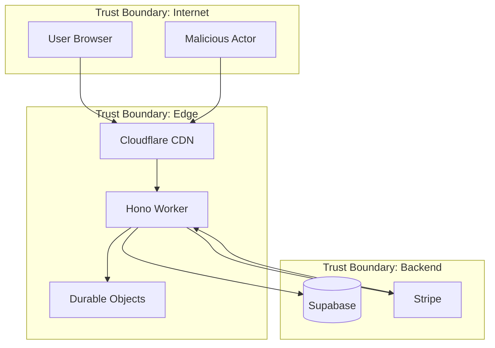
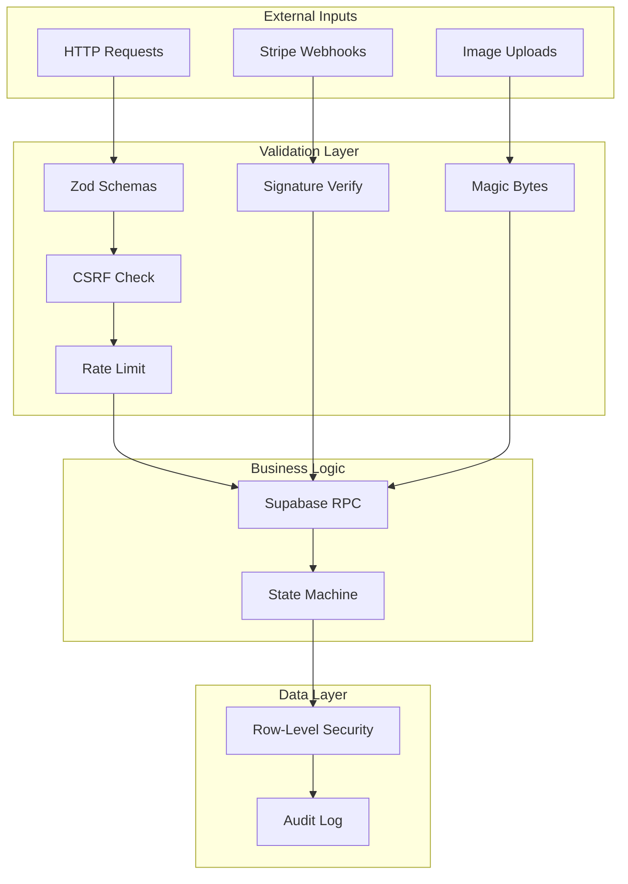

# HQPixels Threat Model

This document analyzes threats to HQPixels using the STRIDE methodology.

## System Overview



## STRIDE Analysis

### S — Spoofing

**Threat: Session Hijacking**

| Vector                       | Control                                     | Status    |
| ---------------------------- | ------------------------------------------- | --------- |
| Steal session cookie via XSS | CSP blocks inline scripts; HttpOnly cookies | Mitigated |
| Session fixation             | Cookies regenerated on login                | Mitigated |
| Token theft via MITM         | HTTPS only; HSTS preload                    | Mitigated |
| Replay stolen token          | Short token TTL (1 hour); refresh rotation  | Mitigated |

**Threat: CSRF (Cross-Site Request Forgery)**

| Vector                         | Control                            | Status    |
| ------------------------------ | ---------------------------------- | --------- |
| Forged form submission         | CSRF token required for mutations  | Mitigated |
| Forged XHR from malicious site | Origin header validation           | Mitigated |
| CSRF via GET                   | Mutations only via POST/PUT/DELETE | Mitigated |

```typescript
// CSRF validation flow
if (requiresCsrf(method)) {
  const headerToken = readCsrfHeader(request);
  const cookieToken = readCookie(request, 'csrf-token');

  if (!verifyCsrf(headerToken, cookieToken, secret)) {
    throw new ApiError('csrf_invalid');
  }
}
```

**Threat: Bot Abuse**

| Vector                     | Control                        | Status    |
| -------------------------- | ------------------------------ | --------- |
| Automated reservation spam | Turnstile CAPTCHA on create    | Mitigated |
| Credential stuffing        | Rate limit (5/min/IP) on login | Mitigated |
| Scraping                   | Rate limit on public endpoints | Mitigated |

---

### T — Tampering

**Threat: Price Manipulation**

| Vector                       | Control                               | Status    |
| ---------------------------- | ------------------------------------- | --------- |
| Client sends fake price      | No price field in request schema      | Mitigated |
| Modify price in transit      | Server computes from DB only          | Mitigated |
| SQL injection in price query | Parameterized queries; Zod validation | Mitigated |

```sql
-- Price is computed server-side, never accepted from client
CREATE FUNCTION quote_total_cents(
  _x int, _y int, _w int, _h int
) RETURNS int AS $$
  SELECT total FROM compute_quote(_x, _y, _w, _h);
$$ LANGUAGE sql STABLE;
```

**Threat: Reservation Data Tampering**

| Vector                            | Control                                        | Status    |
| --------------------------------- | ---------------------------------------------- | --------- |
| Modify reservation after creation | `tg_enforce_reservation_update` blocks changes | Mitigated |
| Double-book same cells            | `pixel_cells` PK on (cell_x, cell_y)           | Mitigated |
| Skip payment state                | State machine trigger validates transitions    | Mitigated |

**Threat: Webhook Payload Tampering**

| Vector               | Control                                 | Status    |
| -------------------- | --------------------------------------- | --------- |
| Forge Stripe webhook | HMAC signature verification on raw body | Mitigated |
| Replay valid webhook | `stripe_events.id` PK prevents replay   | Mitigated |
| Out-of-order events  | Idempotent handlers check current state | Mitigated |

**Threat: Audit Log Tampering**

| Vector               | Control                                       | Status    |
| -------------------- | --------------------------------------------- | --------- |
| Delete audit entries | Trigger blocks DELETE even for service_role   | Mitigated |
| Modify audit entries | Trigger blocks UPDATE                         | Mitigated |
| Forge audit entries  | Only server can INSERT; actor_id from session | Mitigated |

---

### R — Repudiation

**Threat: User Denies Purchase**

| Vector                        | Control                                    | Status    |
| ----------------------------- | ------------------------------------------ | --------- |
| "I didn't make that purchase" | Stripe receipt + audit log with IP         | Mitigated |
| "I didn't upload that image"  | Audit log records upload actor + timestamp | Mitigated |
| "My account was hacked"       | Login audit with IP/UA; email verification | Partial   |

**Threat: Admin Denies Action**

| Vector                           | Control                                  | Status    |
| -------------------------------- | ---------------------------------------- | --------- |
| "I didn't reject that placement" | `moderation_actions` table with actor_id | Mitigated |
| "I didn't grant admin access"    | Admin grant blocked; only DB owner can   | Mitigated |

**Recorded audit events:**

- Session creation (IP, user agent, timestamp)
- Reservation creation (cells, amount, user)
- Payment settlement (Stripe session, amount)
- Moderation actions (action, reason, actor)
- Admin authentication (success/failure)

---

### I — Information Disclosure

**Threat: Sensitive Data in Client Bundle**

| Vector                       | Control                                         | Status    |
| ---------------------------- | ----------------------------------------------- | --------- |
| Secrets in `VITE_*` env vars | Lint rule prevents; only public keys in VITE_*  | Mitigated |
| API keys in source           | `.env` in .gitignore; secrets in Wrangler       | Mitigated |
| User data in error messages  | Errors return generic messages; details in logs | Mitigated |

**Threat: Cross-User Data Access**

| Vector                         | Control                                      | Status    |
| ------------------------------ | -------------------------------------------- | --------- |
| View other user's reservations | RLS policy: `owner_id = auth.uid()`          | Mitigated |
| View other user's payments     | RLS policy: owner-only access                | Mitigated |
| Enumerate user emails          | No user search endpoint; profiles not public | Mitigated |

**Threat: Database Enumeration**

| Vector                   | Control                                  | Status    |
| ------------------------ | ---------------------------------------- | --------- |
| IDOR on reservation IDs  | UUID v4 (122 bits entropy); RLS enforced | Mitigated |
| Sequential ID guessing   | No sequential IDs; all UUIDs             | Mitigated |
| Timing-based enumeration | Constant-time comparisons for auth       | Mitigated |

**Threat: Log Data Exposure**

| Vector          | Control                                   | Status    |
| --------------- | ----------------------------------------- | --------- |
| Secrets in logs | Redacting logger filters sensitive fields | Mitigated |
| PII in logs     | Only IP prefix logged (not full IP)       | Mitigated |
| Log injection   | Input sanitized before logging            | Mitigated |

---

### D — Denial of Service

**Threat: Application-Layer DOS**

| Vector                | Control                                    | Status    |
| --------------------- | ------------------------------------------ | --------- |
| Request flooding      | Rate limiting (60-120/min per IP)          | Mitigated |
| Expensive query abuse | Query complexity limits in RPC             | Mitigated |
| Large payload attacks | Body size limit (64KB JSON, 512KB webhook) | Mitigated |

**Threat: Resource Exhaustion**

| Vector                      | Control                              | Status    |
| --------------------------- | ------------------------------------ | --------- |
| Reserve all cells           | MAX_SELECTION_CELLS = 2500 (25% max) | Mitigated |
| Reservation spam            | Turnstile + rate limit               | Mitigated |
| Unpaid reservation blocking | Auto-expire after 45 minutes         | Mitigated |

**Threat: Distributed Attacks**

| Vector         | Control                              | Status    |
| -------------- | ------------------------------------ | --------- |
| Botnet traffic | Cloudflare DDoS protection           | Mitigated |
| L7 attacks     | Rate limiting + circuit breaker      | Partial   |
| Slow loris     | Cloudflare handles connection limits | Mitigated |

```typescript
// Circuit breaker prevents cascade failures
if (errorRate > ERROR_THRESHOLD) {
  circuitBreaker.open();
  // Reject new mutations for cooldown period
}
```

---

### E — Elevation of Privilege

**Threat: Unauthorized Admin Access**

| Vector                  | Control                                | Status    |
| ----------------------- | -------------------------------------- | --------- |
| Self-grant admin flag   | `tg_protect_profile_privileges` blocks | Mitigated |
| Modify profile via API  | RLS: only name/bio fields writable     | Mitigated |
| SQL injection for admin | Parameterized queries; no raw SQL      | Mitigated |

```sql
-- Triple-layer admin protection
CREATE FUNCTION tg_protect_profile_privileges()
  RETURNS trigger AS $$
BEGIN
  IF NEW.is_admin <> OLD.is_admin THEN
    RAISE EXCEPTION 'admin status cannot be changed via profile update';
  END IF;
  RETURN NEW;
END;
$$ LANGUAGE plpgsql;
```

**Threat: State Machine Bypass**

| Vector                    | Control                                 | Status    |
| ------------------------- | --------------------------------------- | --------- |
| Skip `reserved` → `paid`  | `reservation_transitions` trigger       | Mitigated |
| Direct `expired` → `paid` | Invalid transition blocked              | Mitigated |
| Replay old state          | Current state checked before transition | Mitigated |

```sql
-- Valid state transitions enforced at database level
CREATE TABLE reservation_transitions (
  from_status reservation_status,
  to_status reservation_status,
  PRIMARY KEY (from_status, to_status)
);

INSERT INTO reservation_transitions VALUES
  ('reserved', 'expired'),
  ('reserved', 'cancelled'),
  ('reserved', 'checkout_started'),
  ('checkout_started', 'reserved'),
  ('checkout_started', 'paid'),
  ('paid', 'fulfilled'),
  ('paid', 'refunded');
```

**Threat: RLS Bypass**

| Vector                      | Control                                   | Status    |
| --------------------------- | ----------------------------------------- | --------- |
| Direct table access         | RLS enabled on all tables                 | Mitigated |
| Bypass via SECURITY DEFINER | Explicit grant checks in functions        | Mitigated |
| Service role abuse          | service_role blocked from `grant_admin()` | Mitigated |

---

## Attack Surface Summary



## Threat Priority Matrix

| Threat                     | Likelihood | Impact   | Priority | Status    |
| -------------------------- | ---------- | -------- | -------- | --------- |
| Price tampering            | High       | Critical | P0       | Mitigated |
| Session hijacking          | Medium     | High     | P1       | Mitigated |
| Admin privilege escalation | Low        | Critical | P1       | Mitigated |
| Webhook replay             | Medium     | High     | P1       | Mitigated |
| CSRF                       | Medium     | Medium   | P2       | Mitigated |
| DOS via flooding           | High       | Medium   | P2       | Mitigated |
| Cell double-booking        | Medium     | High     | P1       | Mitigated |
| Audit log tampering        | Low        | High     | P2       | Mitigated |
| User enumeration           | Low        | Low      | P3       | Mitigated |

## Assumptions

1. Cloudflare infrastructure is trustworthy
2. Supabase Auth implementation is secure
3. Stripe webhook signatures are unforgeable
4. PostgreSQL RLS is correctly implemented
5. Attackers cannot compromise admin email accounts

## Out of Scope

- Physical security of data centers
- Social engineering of support staff
- Supply chain attacks on dependencies
- Nation-state level adversaries
- Insider threats with database access
